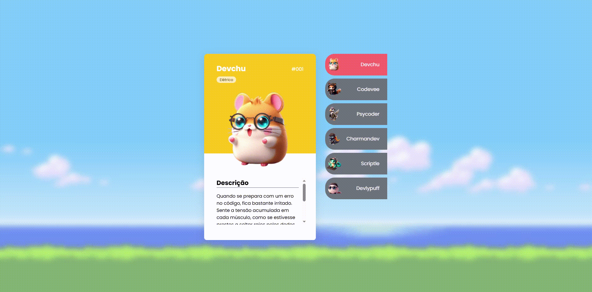

# Pokedevs

## Descrição 📝

Página com alguns Pokedevs.

## Funcionalidades do Projeto✨

- **Visualização de Pokedev**: Um card sempre fica aberto e há outros Pokedevs ao lado, ao clicar no nome o card se abre.
- **Detalhes de Pokedev**: Ao clicar em um Pokedev da lista, abre-se um card com imagem e descrição do Pokedev selecionado.

## Estrutura do Projeto 🗂️

- **src/**: Pasta com os arquivos:
  - **css/**: Contém dois arquivos:
    - **reset**: Reset global.
    - **style**: A estilização da página.
  - **images/**: Comtém as imagens da página e video.
  - **js/**: Interações da página.
- **html**: Códigos em HTML.

## Técnologias utilizadas

## Layout 💻

